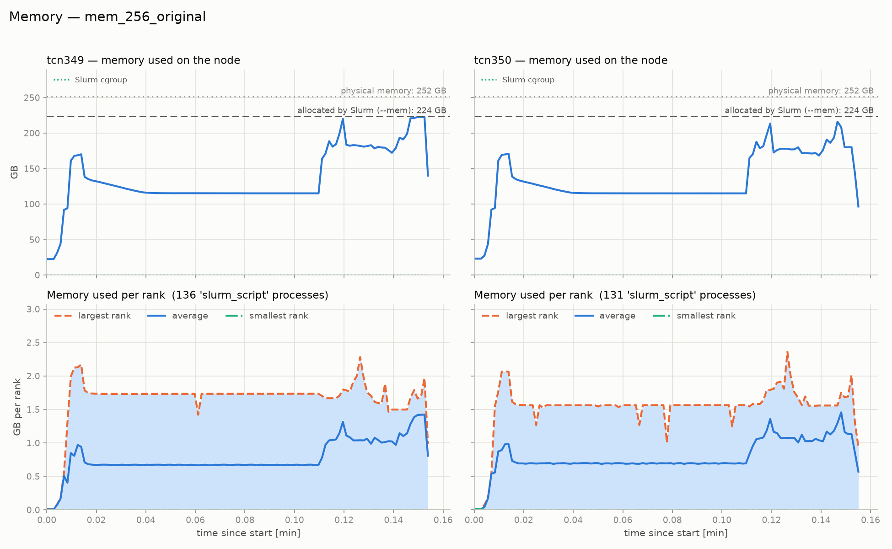
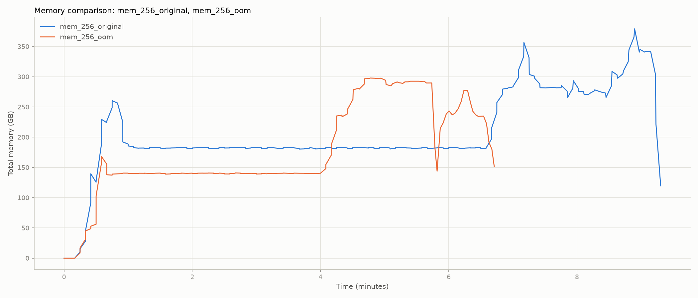
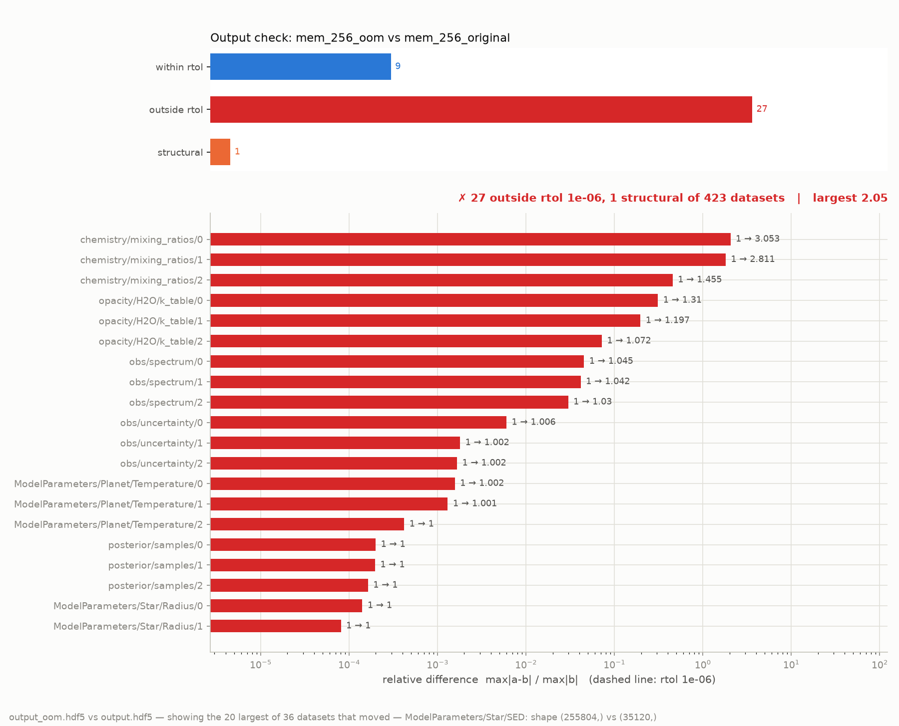

# TauREx memory profiler

Measure and plot where the memory of a TauREx run goes: per node, per MPI rank,
and per process, with optional CPU profiling and timing from the same run.

* per-process **RSS, Pss, RssAnon/RssFile/RssShmem, VmSize, VmPeak** and threads
* node memory against the **physical memory**, the Slurm **`--mem`** limit and
  the job **cgroup** counter (the number the OOM killer uses)
* one sampler per node, so multi-node runs are covered
* Pss by default, which counts MPI-shared pages (opacities) once
* 2- and many-way comparisons, per-node and top-N breakdowns, OOM detection
* optional py-spy CPU flamegraph and wall-clock/fit/sampling timing
* peak memory from `sacct` when a run had no monitor
* a shareable markdown report

Two commands, one per side of a run:

| command | module | role |
|---|---|---|
| `taurex-mem-run` | [`runner.py`](./src/taurex_memory_profiler/runner.py) | run any command with the sampler beside it — the one-liner |
| `taurex-mem-plot` | [`plot.py`](./src/taurex_memory_profiler/plot.py) | all the figures, the text summary and the report |
| — | [`outputs.py`](./src/taurex_memory_profiler/outputs.py) | the output check of `taurex-mem-plot`: did the compared runs write the same result |
| `python -m taurex_memory_profiler.monitor` | [`monitor.py`](./src/taurex_memory_profiler/monitor.py) | the per-node sampler `taurex-mem-run` starts (also usable standalone) |

`python -m taurex_memory_profiler` is the plotter, so the package is usable even
without the console scripts on `PATH`.

Requires Python ≥ 3.9 and Linux (`/proc`); `py-spy` only if you want the CPU
flamegraph, and `h5py` only if the compared runs write HDF5 outputs (the output
check stops with a clear message when it meets an HDF5 file without `h5py`).
Everything else (`numpy`, `pandas`, `matplotlib`) comes with the install.

## Install

```bash
pip install git+https://github.com/eScience-TauRex/taurex-memory-profiler
pip install "taurex-memory-profiler[pyspy] @ git+https://github.com/eScience-TauRex/taurex-memory-profiler"  # + py-spy
```

From a checkout, preferably in a virtual environment:

```bash
python3 -m venv .venv && source .venv/bin/activate
pip install -e .            # numpy, pandas, matplotlib
pip install -e ".[pyspy]"   # …plus py-spy, for the CPU flamegraph
pip install -e ".[hdf5]"    # …plus h5py, to check HDF5 outputs dataset by dataset
```

The sampler is started with the **same interpreter** as `taurex-mem-run`, so on a
cluster install the package into the environment the job activates and it is
available on every node through `srun`. The only thing left to decide is where
the sampler writes and reads its logs (`-o` / `--logdir`, default
`./memory_logs`).

## Quick start

```bash
# 1. monitored run: prefix your MPI command with taurex-mem-run and give it a label
taurex-mem-run -l mem_64_good -- mpirun -np 256 taurex -i parfile.par --retrieval -o output.hdf5 --light

# 2. plot the latest run in ./memory_logs
taurex-mem-plot

# 3. compare two runs by name, straight out of ./memory_logs
taurex-mem-plot --compare mem_64_good mem_64_bad
```

The runs are found by the `-l` label you gave them, so no job id and no path are
needed. Add as many names as you like (`--compare a b c`), and `--report` to also
get the tables.

---

## Running a job under the sampler: `taurex-mem-run`

```bash
taurex-mem-run [options] [--] COMMAND [ARGS...]
```

`taurex-mem-run` starts one `taurex_memory_profiler.monitor` per node, waits for
the first samples, runs your command, stops the samplers on every exit path (so
the CSVs survive an OOM kill), writes `run_<jobid>.meta`, and prints the command
to plot the result. **It returns your command's exit code unchanged**, so
`sbatch` still reports a failed or killed retrieval as such.

An existing job script changes in exactly one line:

```diff
-mpirun -np 256 taurex -i parfile.par --retrieval -o output.hdf5 --light
+taurex-mem-run -l mem_128_good -- mpirun -np 256 taurex -i parfile.par --retrieval -o output.hdf5 --light
```

Everything else — modules, venv, `#SBATCH` lines, `-np 256` — stays in your
script. A complete example:

```bash
#!/bin/bash
#SBATCH --nodes=2
#SBATCH --ntasks-per-node=128
#SBATCH --mem=224G
#SBATCH --partition=rome
#SBATCH --time=2-00:00:00
#SBATCH --output=slurm_%x_%j.out

module purge
module load 2025 foss/2025b Python/3.13.5-GCCcore-14.3.0
export LD_LIBRARY_PATH=/projects/prjs1336/Software/2026/MultiNest/lib:$LD_LIBRARY_PATH
source /projects/prjs1336/Software/2026/taurex34/bin/activate

pip install git+https://github.com/eScience-TauRex/taurex-memory-profiler  # once per environment
taurex-mem-run -l mem_128_good -- mpirun -np 256 taurex -i parfile.par --retrieval -o output.hdf5 --light
```

### Options

| option | default | meaning |
|---|---|---|
| `-o, --outdir DIR` | `memory_logs` | where the CSVs go |
| `-i, --interval SEC` | `5` | sampling interval (may be < 1) |
| `-t, --threads N` | `1` | parallel Pss readers; the monitor step also requests N CPUs |
| `-p, --pattern REGEX` | `.` | only track process names matching, e.g. `'taurex\|prterun'` |
| `-j, --jobid ID` | `$SLURM_JOB_ID` or `local` | used in the file names |
| `-l, --label NAME` | job id | label used by the plots |
| `--pyspy` | off | also record a py-spy CPU flamegraph |
| `--pyspy-rate HZ` | `100` | py-spy sampling rate |
| `--pyspy-out FILE` | `profile_<label>.svg` | py-spy output file |

Environment: `MEM_INTERVAL`, `MEM_THREADS` and `MEM_PATTERN` seed the matching
options, `MEM_RUN_WAIT` sets how long to wait for the first samples (default
`2*interval + 2`). Under Slurm the samplers run as one overlapping `srun` step
per node, requesting `max(1, threads)` CPUs so the Pss threads can run in
parallel; without Slurm only the local node is sampled, which makes
`taurex-mem-run` usable on a login node for short tests.

**Pss is what limits a short interval.** Reading `/proc/<pid>/smaps_rollup`
walks the target's page tables and costs a few milliseconds for a rank with a
large address space, so a serial read over 64 ranks stretches `-i 0.1` to
~0.27 s. `-t 8` overlaps those reads (and asks Slurm for the 8 CPUs they need),
so `-i 0.05` is actually reached; `-t 1` keeps the old single-CPU behaviour.

### CPU profile and timing (`--pyspy`)

`--pyspy` wraps the run in `py-spy record --subprocesses` (so the MPI ranks are
followed too) and writes a flamegraph. The `Samples: N` line py-spy prints is
read back by the plotter, which puts the CPU cost next to the memory cost.
Requires `pip install py-spy`; the job fails immediately with a clear message if
it is missing. A 128-rank flamegraph is large, so use `--pyspy-out` to keep it
out of the way.

---

## Plotting: `taurex-mem-plot`

```bash
taurex-mem-plot [RUN ...] [options]     # or: python -m taurex_memory_profiler
```

### Choosing what to plot

| you have | command |
|---|---|
| one log directory, most recent run | `taurex-mem-plot` |
| two (or more) runs by name in one directory | `taurex-mem-plot --compare mem_64_good mem_64_bad` |
| several runs picked by pattern | `--select 'mem_64_*'` |
| one specific job in a directory | `--job 12345` |
| one directory per run | `good=logs_good --compare bad=logs_bad` |
| individual CSVs | `mem_64.csv --compare mem_64_bad.csv` |
| only an `sacct` dump | `sacct_26968927.txt` |

A `RUN` is one of:

| form | example | meaning |
|---|---|---|
| name | `mem_64_good` | the run labelled `mem_64_good` in `--logdir` |
| file | `mem_64.csv` | one CSV, or an `sacct` dump |
| directory | `logs_good` | most recent run there (or `--job`/`--select`) |
| `LABEL=path[#jobid]` | `good=logs#12345` | explicit path and job, shown as `good` |

A **name** is matched against the `label=` in `run_<jobid>.meta`, which is what
`taurex-mem-run -l` writes, so the name you submitted the job with is the name
you plot it with. `--select GLOB` does the same but keeps every match, so
`--select 'mem_64_*'` overlays a whole row of a grid in one command. With no
`RUN` the tool scans `--logdir` (default `memory_logs`) and uses the most recent
job unless `--job` or `--select` is given.

### Options

| option | meaning |
|---|---|
| `--compare RUN` | overlay another run, by name or path (repeatable, several at once) |
| `--compare2 RUN` | third run (shorthand) |
| `--label NAME`, `--label-a/-b/-c NAME` | labels for the runs |
| `--job ID` | one job inside a log directory |
| `--select GLOB` | every run in the directory whose label or job id matches |
| `--logdir DIR` | directory scanned when no RUN is given |
| `--rss` | plot RSS instead of Pss |
| `--command NAME` | only use these processes for the per-rank statistics |
| `--limit-gb GB` | Slurm `--mem` per node, drawn as a reference line [224] |
| `--project-ranks N` | ranks/node for the memory extrapolation [128] |
| `--per-node` | also draw one line per node |
| `--top N` | also draw the top-N processes by peak memory |
| `--per-run` | with several runs, also write the per-run figures (implied by `--compare`) |
| `--report PATH` | also write a markdown report (peaks, limits, timings, output check) |
| `--title TEXT` | custom title for the comparison figure |
| `--check-output [LABEL=]FILE` | override which output file is compared (automatic: the `-o` of each run) |
| `--no-check-output` | skip that check |
| `--output-rtol`, `--output-atol` | tolerances of the output check [1e-06, 0] |
| `--output-dir DIR` | where to write the figures |
| `--killed` / `--not-killed` | force the OOM marker instead of auto-detecting it |

### What you get

Figures (PNG) are written next to the logs, in the current directory when
the runs come from several directories, or wherever `--output-dir` points:

* `memory_<label>.png` — overview, one column per node (below).
* `memory_<label>_total.png` — total memory over time (all ranks, all nodes).
* `compare_<a>_vs_<b>[_vs_...].png` — overlay of the runs, with a peak table.
* `outputs_<baseline>_vs_<label>.png` — the output check (below).
* `memory_<label>_peak.png` — bar chart of the peak, for runs that only have an
  `sacct` dump.
* `memory_<label>_per_node.png`, `memory_<label>_top<N>.png` — optional breakdowns.

Typical output, comparing two 2-node runs of 256 ranks:


*`memory_<label>.png` — one column per node: memory used (Pss) against the
physical memory, the Slurm `--mem` allocation and the cgroup counter, with the
per-rank smallest/average/largest underneath.*


*`compare_<a>_vs_<b>.png` — the runs overlaid, with the peak table and the `--mem`
limit.*


*`outputs_<baseline>_vs_<label>.png` — did the compared runs produce the same
result: how the datasets split (roster on top), the datasets whose values moved,
worst first, with the value on both sides and the tolerance as a dashed line, and
the verdict in the corner.*

With `--compare`, every compared run gets its own `memory_<label>.png` and
`memory_<label>_total.png` first, so each run can be read on its own and the
`compare_*.png` overlay is written last. `--per-run` does the same for several
runs that were not given with `--compare`.

The [output check](#check-the-runs-did-the-same-work) runs first: it prints to the
terminal and draws its own `outputs_*.png` figure, and with `--report` it also
becomes a table in the markdown.

The text summary and the report give the peak total, the peak per node (next to
the `--mem` limit), the per-rank statistics with the extrapolation to
`--project-ranks` ranks per node, and — when the job log is next to the run — the
wall clock, TauREx runtime, `optimizer.fit()`, MultiNest sampling and the py-spy
CPU sample count.

### Peaks without a monitor (`sacct`)

If a run has no sampler CSV (the monitor was not running, or you only have the
job id), use the Slurm accounting:

```bash
sacct -j 26968927 -P --format=JobID,Elapsed,MaxRSS,MaxVMSize,AveRSS > sacct_26968927.txt
taurex-mem-plot sacct_26968927.txt --compare mem_64_good
```

The dump is detected by its `MaxRSS` column; it contributes a peak to the
summary, the report and the comparison figure. A bare number is read as KiB,
which is what `sacct` reports.

---

## Comparing runs

Comparing is two steps: give each run a name, then plot the names together.

### 1. Name the run

Pass `-l NAME` to `taurex-mem-run`, and let every run write to the same output
directory (default `memory_logs`):

```bash
taurex-mem-run -l mem_64_good -- mpirun -np 128 taurex -i parfile.par --retrieval -o output.hdf5 --light
```

The name is stored in `run_<jobid>.meta` next to the CSVs, so it survives long
after you have forgotten the job id.

### 2. Plot the names

```bash
# compare two runs that both live in ./memory_logs
taurex-mem-plot --compare mem_64_good mem_64_bad

# keep the tables too
taurex-mem-plot --compare mem_64_good mem_64_bad \
    --report memory_logs/report_good_vs_bad.md
```

That is the whole interface: `--compare` takes run names, as many as you like,
and each one is looked up in `--logdir`. Use `LABEL=PATH` instead of a name when
the run lives somewhere else, e.g. `--compare bad=logs_bad` or
`--compare bad=logs_bad#12345` (a third run goes under `--compare2`, or just list
it in the same `--compare`). The first run can be a name too:

```bash
taurex-mem-plot mem_64_good --compare mem_64_bad
```

Labels on the figures default to the run names, so the plot is readable without
renaming anything afterwards. Each compared run is plotted on its own first
(`memory_<name>.png` and `memory_<name>_total.png`), and the `compare_*.png`
overlay is written last.

### Picking runs by pattern

If you name the runs of a grid after their axes — `mem_64_good`, `mem_64_bad`,
`mem_128_good` — you can select a whole row with a glob, instead of listing the
names:

```bash
# every run whose name starts with mem_64_
taurex-mem-plot --select 'mem_64_*'

# the whole grid in one table
taurex-mem-plot --select 'mem_*' --report memory_logs/report_grid.md
```

`--select` accepts names and job ids, and combines with `--logdir`. A grid that
varies the node layout is just the same job script submitted with different
`--nodes`/`--ntasks-per-node` and `-l`. One report per axis value, e.g. for a
scaling study:

```bash
for cfg in 32 64 128; do
    taurex-mem-plot --select "mem_${cfg}_*" \
        --title "${cfg} ranks/node" --report "memory_logs/report_${cfg}.md"
done
```

### Check the runs did the same work

Memory is only comparable if the runs produced the same result, so every
`--compare` also checks their outputs and says so before drawing anything:

```
--- Output check (baseline mem_256_original) ---
mem_256_oom: output_oom.hdf5 - DIFFERENT from output.hdf5 (332 of 423 datasets, largest 2.09 relative)
    - Output/Solutions/solution0/fit_params/log_lee_mie_radius/nest_map: relative difference 2.09 (-2.90606 vs -0.940162)
    - ModelParameters/Planet/mass_kg: relative difference 1 (0.12 vs 2.27775e+26)
    - ... and 330 more
```

The file is the `-o` of the command recorded in each run's `run_<jobid>.meta`,
looked up next to the logs and one directory up — the same name per run is not
required, so `output.hdf5` and `output_oom.hdf5` compare fine. Point at it
manually when the run was started outside `taurex-mem-run`:

```bash
taurex-mem-plot --compare mem_256_original mem_256_oom \
    --check-output output.hdf5 --check-output mem_256_oom=output_oom.hdf5
```

A `[LABEL=]FILE` applies to that run, a plain `FILE` to every run. What is
compared:

| file | comparison |
|---|---|
| `.h5` / `.hdf5` | every dataset, within `--output-rtol`/`--output-atol`, plus the structure |
| anything else | bytes |

Every compared run is checked against the first (baseline) one, and the verdict
is `same` or `DIFFERENT`. Differences are listed worst first; a dataset's
**relative difference** is `max|a-b| / max|b|`, so it is not inflated by elements
that are close to zero — 0.01 means the dataset changed by one percent of its own
size, 1 that it changed completely. Two files of different kinds (an HDF5 against
a text file) are reported as such instead of being compared. An HDF5 output that
cannot be read at all — the truncated file an OOM-killed run leaves behind, for
instance — is reported as `unreadable output` instead of aborting the
comparison. Use `--no-check-output` to skip the check, and `--report` to get the
same table in the markdown.

When the two outputs are comparable the check draws
`outputs_<baseline>_vs_<label>.png`, with two panels so the numbers are always
on the figure:

* a **roster** of how the compared datasets split — identical, within the
  tolerance, outside it, and structural (a shape or dtype difference, which has
  no numeric value to plot);
* the **detail**: one bar per dataset that moved, worst first, red outside the
  tolerance and blue inside it, with the tolerance as a dashed line and each bar
  labelled with the value of its worst element in both runs. The datasets inside
  the tolerance are drawn too, so a run that passes still shows how close it was.
  When nothing moved numerically the panel says so with the counts and lists what
  did differ.

A truncated or unreadable output has nothing to draw, so the figure is skipped
and only the `unreadable output` line is reported.

### Read the comparison

* **Peak per node against `--mem`** is the headline: it tells you whether the run
  fits and how much headroom is left. The cgroup line is what the OOM killer
  actually watches.
* **Pss, not RSS**, sizes `--mem` — RSS double-counts shared MPI pages.
* **Per-rank largest vs average** shows imbalance: a few heavy ranks can push a
  node over the limit while the average looks fine.
* **The extrapolation** (`--project-ranks`) estimates the node footprint at a
  different rank count, assuming memory scales with the ranks; use it to pick a
  layout, then confirm with a real run.
* **The report** puts memory and timing side by side, which is what you need to
  choose between environments — a run is only better if it is not slower.

### Share it

The `--report` markdown plus the PNG figures are self-contained: they list
the runs, the peaks against the limit, the relative differences, the timings, the
output check, and the per-node table. Copy them next to the logs, or commit them with the results.

---

## The sampler: `python -m taurex_memory_profiler.monitor`

Normally you never call this directly; `taurex-mem-run` does, once per node. Run
it standalone to attach the sampler to something already running:

```bash
python -m taurex_memory_profiler.monitor [-o OUTDIR] [-i INTERVAL] [-p PATTERN] [-j JOBID]
```

| option | default | meaning |
|---|---|---|
| `-o, --outdir` | `memory_logs` (`$MEM_OUTDIR`) | where the CSVs go |
| `-i, --interval` | `5` (`$MEM_INTERVAL`) | seconds between samples, may be < 1 |
| `-t, --threads` | `1` (`$MEM_THREADS`) | threads reading Pss in parallel; >1 needs the CPUs free |
| `-p, --pattern` | `.` (`$MEM_PATTERN`) | only track process names matching this regex |
| `-j, --jobid` | `$SLURM_JOB_ID` or `local` | used in the file names |

Stop it with `SIGTERM`/`SIGINT`, or (from another shell) by creating
`<outdir>/.stop_<jobid>` — that file is also how `taurex-mem-run` stops every
node at once.

It writes, per node:

```
memory_logs/memory_<jobid>_<node>.csv        one row per process per sample
memory_logs/node_memory_<jobid>_<node>.csv   one row per node per sample
```

Process columns: `timestamp,node,pid,ppid,command,rss_kb,pss_kb,vsz_kb,vmpeak_kb,`
`data_kb,threads,rss_anon_kb,rss_file_kb,rss_shmem_kb,elapsed_s`.

Node columns: `timestamp,node,mem_total_kb,mem_available_kb,mem_used_kb,`
`mem_used_percent,cgroup_mem_kb,swap_used_kb,shmem_kb,load1,load5,load15,`
`user_procs,user_rss_kb,user_pss_kb,user_rss_anon_kb,elapsed_s`.

The CSVs are written and flushed sample by sample, so they survive an OOM kill.

> Keep the interval sane: 5 s over 48 h and 128 ranks is ~300 MB per node, while
> 0.01 s would be ~100 GB. Sub-second sampling is only for short runs.

---

## Troubleshooting

* **"no memory logs found"** — the sampler writes to `memory_logs/` relative to
  the job's working directory. Pass the right one with `--logdir` (or `-o` when
  sampling).
* **A run has no timing rows** — timing comes from the Slurm log; make sure
  `#SBATCH --output` writes `slurm_<jobname>_<jobid>.out` in the submit
  directory, as the example does.
* **No comparison figure** — a single run gives the overview and total figures; a
  comparison needs two or more runs.
* **Output check says "not checked"** — no output file was recorded in
  `run_<jobid>.meta` (or the run was started by hand); pass `--check-output FILE`,
  or `--no-check-output` if the runs are meant to differ.
* **`--select` matches nothing** — it matches the label from
  `run_<jobid>.meta` or the job id; the error lists what is available.
* **`pss_kb` is 0 for some processes** — `/proc/<pid>/smaps_rollup` was not
  readable for them (usually processes of another user). The plotter falls back
  to RSS only when the whole column is empty.
* **OOM not marked** — detection scans the `*.out` logs next to the run for
  `oom_kill` / `Out of memory`, and for the run's own `Exit code: 137` / `-9`
  line (Slurm does not always write the `oom_kill` summary); use `--killed` when
  the log is elsewhere.
* **`taurex-mem-run` not found** — install the package into the environment the
  job activates, *before* the `taurex-mem-run` line, so `PATH` is set up by the
  time Slurm runs the job.
* **`No module named taurex_memory_profiler` in the sampler output** — the
  environment is not visible from the other nodes; install into a shared
  filesystem (`/projects`, `/home`) rather than a node-local one.

---

## Development

```bash
pip install -e ".[tests]"
pytest                       # or, no test runner needed:
python tests/test_plot.py
python tests/test_monitor.py
python tests/test_runner.py
```

The checks call the command line, so they exercise exactly what a user types;
`tests/_helpers.py` puts `src/` on `PYTHONPATH`, which makes a plain checkout
work uninstalled. CI runs them on Python 3.9 and 3.13.

```
src/taurex_memory_profiler/
    monitor.py   per-node sampler: reads /proc, writes the two CSVs
    runner.py    taurex-mem-run: starts the samplers and runs the command
    plot.py      taurex-mem-plot: figures, text summary and report
    outputs.py   the output check: same result in every compared run
docs/            the figures shown above, from a 2-node 256-rank comparison
```
